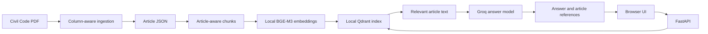

# Mizan — Egyptian Civil Code Assistant

Mizan is a small retrieval-augmented generation (RAG) application for asking questions about the Egyptian Civil Code in Arabic or English. It retrieves relevant code articles from a local Qdrant index, sends the question and retrieved context to the configured Groq model, and returns an answer with source references. The web interface and API are served together by FastAPI.

> This is a learning and research tool, not legal advice. Check the cited legal text and consult a qualified lawyer for decisions about a real case.

## What is included

- Column-aware PDF ingestion that separates the Arabic and English text into article records.
- Article-aware chunks and local embeddings using `BAAI/bge-m3` from the Hugging Face cache. Downloads are disabled in the project code; the embedding model must already exist locally.
- A persistent local Qdrant index and semantic search.
- Groq answer generation grounded in retrieved articles, with returned source references.
- A responsive, bilingual-input web UI at `/`, API endpoints at `/ask` and `/health`, and interactive API documentation at `/docs`.
- A DVC pipeline for corpus and index preparation, plus RAGAS evaluation tracked in MLflow.

## How the application works



The user interface uses the same origin as the API; it does not need a separate frontend server or CORS configuration. A request follows this path:

1. The browser sends a question to `POST /ask`.
2. The retriever embeds the question with the local BGE-M3 model and searches Qdrant.
3. The generator asks the configured Groq model to answer using the retrieved article text.
4. The API returns `answer` and `sources`, and the UI displays both.

## Project structure

```text
.
├── frontend/
│   ├── index.html             # Web app structure
│   ├── styles.css             # Responsive visual design
│   └── app.js                 # Health check, question flow, answers and citations
├── data/
│   ├── raw/                   # Source Civil Code PDF (managed with DVC)
│   ├── processed/             # Extracted articles and generated chunks
│   └── evaluation/            # Evaluation questions and expected context
├── qdrant_storage/            # Local persistent vector index
├── reports/                   # Corpus quality and experiment reports
├── src/
│   ├── api/
│   │   ├── main.py            # FastAPI routes and frontend hosting
│   │   └── schemas.py         # Request and response validation
│   ├── ingestion/
│   │   └── build_corpus.py    # PDF to bilingual article records
│   ├── rag/
│   │   ├── chunking.py        # Article-aware chunk preparation
│   │   ├── indexing.py        # Local embeddings and Qdrant index creation
│   │   ├── retriever.py       # Semantic search
│   │   └── generator.py       # Groq grounded answer generation
│   └── experiments/
│       └── evaluate_rag.py    # RAGAS evaluation and MLflow tracking
├── tests/                     # Corpus, retrieval, and API tests
├── params.yaml                # Model, paths, retrieval and generation settings
├── dvc.yaml                   # Data and index pipeline stages
├── dvc.lock                   # Recorded pipeline inputs and outputs
├── Dockerfile
├── docker-compose.yml
└── pyproject.toml              # Python dependencies and tool settings
```

## Requirements

- Windows with PowerShell, or another environment that can run Python 3.10 or newer.
- Git and DVC installed for reproducing the data pipeline. DVC is also listed as a Python dependency.
- The source dataset tracked by DVC, or the generated files already present under `data/processed/`.
- The `BAAI/bge-m3` embedding model already downloaded into the Hugging Face cache used by this project.
- A Groq API key for generating answers and running the full evaluation. The question and retrieved article excerpts are sent to Groq for answer generation.

The embedding model is used locally for both indexing and retrieval. The answer-generation model is configured separately in `params.yaml` and accessed through Groq.

## Run the full project locally

Run commands from the repository root in PowerShell.

### 1. Configure the Groq key

Copy the example environment file and add your key. Keep `.env` private and do not commit it.

```powershell
Copy-Item .env.example .env
notepad .env
```

Set `GROQ_API_KEY` to the key from your Groq account. Do not include quotes unless they are part of the key.

### 2. Install dependencies

```powershell
py -m venv .venv
.\.venv\Scripts\Activate.ps1
python -m pip install --upgrade pip
pip install -e ".[dev]"
```

If PowerShell blocks virtual environment activation, use `..venv\Scripts\python.exe -m pip install -e ".[dev]"` and run Python commands through that interpreter.

### 3. Prepare the corpus, chunks and search index

```powershell
dvc repro
```

The pipeline extracts the PDF, produces article-aware chunks, and builds the Qdrant index using the locally cached BGE-M3 model. It can take time on the first run. If the source PDF is not present, check out or restore the DVC-tracked data before rerunning this command. The project currently has no shared DVC remote configured, so data is not downloaded from a project remote automatically.

If generated corpus and index files are already present and current, this step may finish without rebuilding them.

### 4. Start the UI and API

```powershell
uvicorn src.api.main:app --reload
```

Open [http://localhost:8000](http://localhost:8000) to use Mizan. The first health check verifies access to the local Qdrant index. Ask a question in Arabic or English; the answer appears with source references.

Other useful URLs:

- [http://localhost:8000/docs](http://localhost:8000/docs) — interactive API docs.
- [http://localhost:8000/health](http://localhost:8000/health) — API and indexed-document count.

## API reference

### `GET /health`

Example response:

```json
{
  "status": "healthy",
  "documents_indexed": 1250
}
```

### `POST /ask`

Request body:

```json
{
  "question": "ما أثر العقد الصحيح بين الطرفين؟"
}
```

Example response:

```json
{
  "answer": "...",
  "sources": ["Article 147", "Article 148"]
}
```

Blank questions are rejected with HTTP 422. If answer generation or retrieval fails, the API returns an error response; check that the API key, local model cache and Qdrant index are available.

PowerShell request example:

```powershell
$body = @{ question = "ما أثر العقد الصحيح بين الطرفين؟" } | ConvertTo-Json
Invoke-RestMethod -Method Post -Uri http://localhost:8000/ask -ContentType "application/json" -Body $body
```

## Docker

After preparing the data and Qdrant index, create `.env` as described above and run:

```powershell
docker compose up --build
```

The app is available at [http://localhost:8000](http://localhost:8000). Compose mounts the project Qdrant storage and the Windows user's Hugging Face cache into the container. If your model cache is stored elsewhere, update the cache volume in `docker-compose.yml`. Stop the service with `Ctrl+C`; use `docker compose down` to remove the stopped container.

## Configuration

Edit `params.yaml` to change the input/output paths, embedding model name, Qdrant collection and storage, retrieval `top_k`, MLflow settings, or Groq generation model and generation parameters. The currently selected embedding model is `BAAI/bge-m3`. Its files must be available in the local Hugging Face cache before indexing or serving.

The frontend is plain HTML, CSS, and JavaScript under `frontend/`. It calls relative `/ask` and `/health` URLs, so the UI and API remain connected when served locally or from Docker.

## Evaluation and tracking

The evaluation script compares five `top_k` settings over 20 evaluation questions. It makes Groq generation calls, evaluates faithfulness, context precision, context recall, and answer relevancy, and records runs in MLflow. It also writes `reports/ragas_summary.json`, chooses a best setting, and records the result as `EgyptianLegalRAG@champion`.

Run the evaluation:

```powershell
python -m src.experiments.evaluate_rag
```

Open the local MLflow UI in another terminal:

```powershell
mlflow ui --backend-store-uri sqlite:///mlflow.db
```

Then visit [http://localhost:5000](http://localhost:5000). Evaluation needs the local embedding model, prepared index/data and a valid Groq key. The evaluation script's configured quality threshold can cause a run to exit with failure if the best faithfulness score is too low.

## Tests and code style

Install the development extras with `pip install -e ".[dev]"`, then run:

```powershell
pytest
ruff check .
```

The test suite covers corpus processing, retrieval, and API request/response behavior. Tests that need the model or vector database depend on those local resources being prepared.

## Data and operational notes

- See [reports/corpus-quality.md](reports/corpus-quality.md) for extraction quality observations.
- Qdrant data is stored locally in `qdrant_storage/`; keep it available between runs.
- The local embedding model is not downloaded by application startup. This avoids implicit network access and uses the model you already have on the device.
- The Groq API key belongs in `.env`, never in source files or frontend code.
- A shared DVC remote, CI image publishing credentials, BentoML/vLLM serving, Langfuse tracing, streaming, load-test reports and drift alerts are not configured in this local project.
