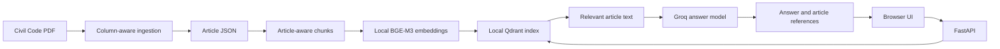

# Mizan — Egyptian Civil Code Assistant

[](https://github.com/AbdarhmanAmin/egyptian-legal-rag/actions/workflows/ci-cd.yml)

Mizan is a small retrieval-augmented generation (RAG) application for asking questions about the Egyptian Civil Code in Arabic or English. It retrieves relevant code articles from a local Qdrant index, sends the question and retrieved context to the configured Groq model, and returns an answer with source references. The web interface and API are served together by FastAPI.

> This is a learning and research tool, not legal advice. Check the cited legal text and consult a qualified lawyer for decisions about a real case.

## Quick start

From PowerShell in the repository folder, create `.env` once from `.env.example` and set `GROQ_API_KEY`, then run:

```powershell
.\.venv311\Scripts\python.exe -m pip install -e ".[dev,pipeline,evaluation]"
.\.venv311\Scripts\dvc.exe repro
.\.venv311\Scripts\python.exe -m uvicorn src.api.main:app --reload
```

Open [http://localhost:8000](http://localhost:8000). Docker Desktop is only required if you choose the container option below.

## What is included

- Column-aware PDF ingestion that separates the Arabic and English text into article records.
- Article-aware chunks and local embeddings using `BAAI/bge-m3` from the Hugging Face cache. Downloads are disabled in the project code; the embedding model must already exist locally.
- A persistent local Qdrant index and semantic search.
- Groq answer generation grounded in retrieved articles, with returned source references. The configured default is Qwen 3.8 27B (`qwen/qwen3.8-27b`); change `generator.model_name` in `params.yaml` to select another supported Groq model.
- A responsive, bilingual-input web UI at `/`, API endpoints at `/ask` and `/health`, and interactive API documentation at `/docs`.
- A DVC pipeline for corpus and index preparation, plus RAGAS evaluation tracked in MLflow.

## How the application works



The user interface uses the same origin as the API; it does not need a separate frontend server or CORS configuration. A request follows this path:

1. The browser sends a question to `POST /ask`.
2. The retriever embeds the question with the local BGE-M3 model and searches Qdrant.
3. The generator asks the configured Groq model to answer using the retrieved article text.
4. The API returns `answer` and `sources`, and the UI displays both.

## Project structure

```text
.
├── frontend/
│   ├── index.html             # Web app structure
│   ├── styles.css             # Responsive visual design
│   └── app.js                 # Health check, question flow, answers and citations
├── data/
│   ├── raw/                   # Source Civil Code PDF (managed with DVC)
│   ├── processed/             # Extracted articles and generated chunks
│   └── evaluation/            # Evaluation questions and expected context
├── qdrant_storage/            # Local persistent vector index
├── reports/                   # Corpus quality and experiment reports
├── src/
│   ├── api/
│   │   ├── main.py            # FastAPI routes and frontend hosting
│   │   └── schemas.py         # Request and response validation
│   ├── ingestion/
│   │   └── build_corpus.py    # PDF to bilingual article records
│   ├── rag/
│   │   ├── chunking.py        # Article-aware chunk preparation
│   │   ├── indexing.py        # Local embeddings and Qdrant index creation
│   │   ├── retriever.py       # Semantic search
│   │   └── generator.py       # Groq grounded answer generation
│   └── experiments/
│       └── evaluate_rag.py    # RAGAS evaluation and MLflow tracking
├── tests/                     # Corpus, retrieval, and API tests
├── .github/workflows/
│   └── ci-cd.yml              # PR checks and Docker image delivery from main
├── params.yaml                # Model, paths, retrieval and generation settings
├── dvc.yaml                   # Data and index pipeline stages
├── dvc.lock                   # Recorded pipeline inputs and outputs
├── Dockerfile
├── docker-compose.yml
└── pyproject.toml              # Python dependencies and tool settings
```

## Requirements

- Windows with PowerShell, or another environment that can run Python 3.10 or newer.
- Git and DVC installed for reproducing the data pipeline. DVC is also listed as a Python dependency.
- The source dataset tracked by DVC, or the generated files already present under `data/processed/`.
- The `BAAI/bge-m3` embedding model already downloaded into the Hugging Face cache used by this project.
- A Groq API key for generating answers and running the full evaluation. The question and retrieved article excerpts are sent to Groq for answer generation.

The embedding model is used locally for both indexing and retrieval. The answer-generation model is configured separately in `params.yaml` and accessed through Groq.

## Run the full project locally

Run commands from the repository root in PowerShell.

### 1. Configure the Groq key

Copy the example environment file and add your key. Keep `.env` private and do not commit it.

```powershell
Copy-Item .env.example .env
notepad .env
```

Set `GROQ_API_KEY` to the key from your Groq account. Do not include quotes unless they are part of the key.

### 2. Install dependencies

```powershell
py -3.11 -m venv .venv311
.\.venv311\Scripts\Activate.ps1
python -m pip install --upgrade pip
python -m pip install -e ".[dev,pipeline,evaluation]"
```

This installs the service, DVC pipeline, MLflow/RAGAS evaluation tools, and developer tools. Use Python 3.11 for this project; RAGAS 0.2 uses an asyncio compatibility patch that fails under Python 3.14. If PowerShell blocks virtual environment activation, use `.\.venv311\Scripts\python.exe -m pip install -e ".[dev,pipeline,evaluation]"` and run Python commands through that interpreter.

### 3. Prepare the corpus, chunks and search index

```powershell
.\.venv311\Scripts\dvc.exe status
.\.venv311\Scripts\dvc.exe dag
.\.venv311\Scripts\dvc.exe repro
```

`dvc dag` shows the dependency graph: source PDF → article corpus → article chunks → Qdrant index. `dvc repro` runs stale stages in order and records hashes and parameters in `dvc.lock`. Run `dvc repro` a second time without changing inputs to demonstrate that DVC reuses cached stage outputs. `dvc status` shows changed or missing dependencies and outputs.

The source PDF has a DVC pointer file, but this project does not currently have a shared DVC remote. A clean clone cannot retrieve the DVC-managed files until a remote is configured and its data is pushed. The corpus and chunking stages write DVC metrics to `reports/corpus_metrics.json` and `reports/chunking_metrics.json`; use the commands below to inspect them.

### 4. Start the UI and API

```powershell
.\.venv311\Scripts\python.exe -m uvicorn src.api.main:app --reload
```

Open [http://localhost:8000](http://localhost:8000) to use Mizan. The first health check verifies access to the local Qdrant index. Ask a question in Arabic or English; the answer appears with source references.

Other useful URLs:

- [http://localhost:8000/docs](http://localhost:8000/docs) — interactive API docs.
- [http://localhost:8000/health](http://localhost:8000/health) — API and indexed-document count.

## API reference

### `GET /health`

Example response:

```json
{
  "status": "healthy",
  "documents_indexed": 1250
}
```

### `POST /ask`

Request body:

```json
{
  "question": "ما أثر العقد الصحيح بين الطرفين؟"
}
```

Example response:

```json
{
  "answer": "...",
  "sources": ["Article 147", "Article 148"]
}
```

Blank questions are rejected with HTTP 422. If answer generation or retrieval fails, the API returns an error response; check that the API key, local model cache and Qdrant index are available.

PowerShell request example:

```powershell
$body = @{ question = "ما أثر العقد الصحيح بين الطرفين؟" } | ConvertTo-Json
Invoke-RestMethod -Method Post -Uri http://localhost:8000/ask -ContentType "application/json" -Body $body
```

## Docker

After preparing the data and Qdrant index, create `.env` as described above, start Docker Desktop with its Linux engine, and run:

```powershell
docker compose up --build
```

The app is available at [http://localhost:8000](http://localhost:8000). The Dockerfile uses separate build and runtime stages, installs CPU-only PyTorch from the official PyTorch CPU wheel index, installs only the API dependencies, runs as the unprivileged `mizan` user, and does not bake the local vector index or model cache into the image. CPU-only PyTorch is suitable for this container's inference path and avoids downloading the CUDA and NVIDIA runtime packages included with the default PyPI GPU wheel. The PyTorch library itself is still a large dependency, and the first build must download it; later builds can reuse Docker's cached dependency layer unless the dependency inputs change. Compose mounts the project Qdrant storage and the Windows user's Hugging Face cache into the container. If your model cache is stored elsewhere, update the cache volume in `docker-compose.yml`. Stop the service with `Ctrl+C`; use `docker compose down` to remove the stopped container.

If the CLI reports that it cannot connect to `dockerDesktopLinuxEngine`, start Docker Desktop and wait for the engine, then confirm `docker info` works before retrying the build. That connection error occurs before the Dockerfile is built.

## DVC: what is tracked and what remains

`dvc.yaml` defines three local pipeline stages:

1. `build_corpus` extracts Arabic and English article records from the source PDF.
2. `chunking` keeps each article together unless it exceeds the configured character limit, then splits it with the configured overlap while retaining article citation metadata. The settings are in `params.yaml` and are DVC parameters.
3. `indexing` embeds chunks with the local BGE-M3 model and creates the Qdrant collection.

`dvc.lock` records the input/output hashes and parameters from the last successful run. DVC uses those records and its local cache to decide what must be repeated. The corpus stage reports total, active, and repealed article counts plus Arabic and English text coverage. The chunking stage reports article and chunk counts, chunk size, overlap, and average chunks per article. `reports/corpus_metrics.json` and `reports/chunking_metrics.json` are declared as DVC metrics, so they are shown separately from cached pipeline outputs.

After changing code or parameters and reproducing the affected stages, inspect the current values:

```powershell
.\.venv311\Scripts\dvc.exe metrics show
```

To compare metrics with a previous committed version, commit the code, `dvc.yaml`, `dvc.lock`, and metric files first, then change a setting (for example `chunking.chunk_size` in `params.yaml`) and rerun `dvc repro`. Compare against the commit:

```powershell
.\.venv311\Scripts\dvc.exe metrics diff HEAD^
```

`HEAD^` is the previous Git commit; on the first commit, use a commit hash that contains the earlier metrics instead. No shared DVC remote is configured, so these pipeline files and metrics remain local. Setting up a remote is optional; it can be added later if you need to share data with another machine or collaborator.

## CI/CD: how to run and view it

`.github/workflows/ci-cd.yml` is triggered on pull requests to `main`, pushes to `main`, and manual workflow dispatch:

- The `checks` job installs the app and development dependencies, runs Ruff and Black, then tests the API and retrieval behavior with the model/vector search mocked. It saves a coverage report as a workflow artifact.
- After checks pass, the `image` job builds the Docker image. Pull requests build without publishing. A push to `main` publishes commit-SHA and `latest` tags to Docker Hub.

To enable image publishing, create a Docker Hub access token and configure these repository settings in GitHub under **Settings → Secrets and variables → Actions**:

- Repository variable `DOCKERHUB_USERNAME` — your Docker Hub username.
- Repository secret `DOCKERHUB_TOKEN` — a Docker Hub access token with permission to push the image.

Push the workflow to GitHub, open **Actions**, and select **CI and image delivery** to see live job logs. A pull request should show lint, tests and image build. A successful merge/push to `main` should also show Docker Hub login and image publishing. Require the workflow check in branch protection under **Settings → Branches** if you want GitHub to block merges when checks fail.

This workflow does not run the RAGAS experiment or full DVC pipeline in CI: those need Groq API calls, local model files, and data that is not downloadable from a shared DVC remote yet. The local RAGAS command below enforces the faithfulness threshold before model promotion. CI publishes an image but does not deploy it to a live production service.

## Configuration

Edit `params.yaml` to change the input/output paths, embedding model name, Qdrant collection and storage, retrieval `top_k`, MLflow settings, or Groq generation model and generation parameters. The currently selected embedding model is `BAAI/bge-m3`. Its files must be available in the local Hugging Face cache before indexing or serving.

The frontend is plain HTML, CSS, and JavaScript under `frontend/`. It calls relative `/ask` and `/health` URLs, so the UI and API remain connected when served locally or from Docker.

## Evaluation and tracking

The evaluation script compares five article-aware chunking configurations (`chunk_size` and `overlap`) using the configured local embedding model and `top_k` (currently `3` retrieved passages to reduce unrelated context). `evaluation.question_limit` in `params.yaml` controls the number of questions; it is set to `3` for a quicker local run, with a deterministic sample selected from the evaluation set. Each configuration records the four handbook RAGAS metrics: `faithfulness`, `context_precision`, `context_recall`, and `answer_relevancy`. It also records `retrieval_hit_at_k`, which checks whether the question's known target article appeared in the retrieved passages. The judge receives the same cited, status-labeled article context as the answer model, and the local BGE-M3 embedding model is reused for answer relevancy. Each report records per-question scores and retrieved article numbers so weak cases can be diagnosed. Answer relevancy generates one candidate question per answer to reduce Groq token use; its setting is logged with each run. The RAGAS prompts request concise judgments, `evaluation.max_tokens` defaults to `500`, and `evaluation.max_retries` limits time lost to repeated failures. Query embeddings are calculated once, and generated answers are cached under `reports/ragas_runs/`, so a retry can continue scoring without regenerating them. A completed evaluation keeps only its latest five chunking runs visible in MLflow; interrupted runs do not hide the last completed comparison. The script writes the comparison to `reports/ragas_summary.json`. Runs with fewer than 20 questions are for quick comparison only and do not trigger model promotion. Set `evaluation.question_limit` to `20` for the full quality gate; if the best faithfulness score reaches `0.75`, the script saves the winning chunk settings, rebuilds the production chunks and index, registers `EgyptianLegalRAG`, and promotes it to Production with a `champion` alias. A failed quality gate leaves the current production index/configuration in place.

MLflow displays runs that have already been logged; starting its UI does not run the DVC pipeline or evaluation. To create a small tracking run without calling Groq, rerun the chunking stage (this stage logs `article_chunking` to the experiment configured in `params.yaml`):

```powershell
dvc repro chunking --force
```

Then, from the repository root, open the same SQLite tracking store in another terminal:

```powershell
mlflow ui --backend-store-uri sqlite:///mlflow.db --workers 1
```

Then visit [http://localhost:5000](http://localhost:5000) and select the `egyptian-legal-rag-project2` experiment. The project code and `params.yaml` both use `sqlite:///mlflow.db`; run commands and the UI must be launched from the repository root so this relative URI points to the same database. The `--workers 1` setting avoids the multi-process worker startup issue shown in some Windows environments.

An older `mlruns/` folder may contain runs from a previous file-based tracking store. Those runs are separate from `mlflow.db`; the UI command above intentionally shows the SQLite database used by the current project configuration. The message `Registry store URI not provided. Using backend store URI.` is informational. MLflow's Windows job-backend warning means job execution features are unavailable on Windows; it does not prevent ordinary experiment/run tracking.

To make the five handbook comparison runs, ensure the local embedding model and prepared corpus/index are available and `GROQ_API_KEY` is set, then run from the repository root:

```powershell
.\.venv311\Scripts\python.exe -m src.experiments.evaluate_rag
.\.venv311\Scripts\dvc.exe repro
```

The evaluation makes Groq calls for each selected question and each of the five chunking configurations, followed by RAGAS scoring. With the current `question_limit: 3`, it records five comparable MLflow runs with three questions each, without rebuilding or promoting a model. If a run fails during scoring, start the same command again; cached answers let it retry the failed score without repeating answer generation. For a final handbook run, change `evaluation.question_limit` to `20`; only then can the script apply the `0.75` faithfulness gate and register/promote the winning configuration. In the MLflow UI, select the `egyptian-legal-rag-project2` experiment and compare the five `article_chunk_size_*` runs. The registry keeps the handbook's `Production` stage and a `champion` alias; MLflow now recommends aliases for new workflows because stages are deprecated. [MLflow registry workflow](https://mlflow.org/docs/latest/ml/model-registry/workflow/).

## Tests and code style

Install the developer tools with `pip install -e ".[dev]"` (or use the complete install above), then run:

```powershell
pytest
ruff check .
```

The test suite covers corpus processing, retrieval, and API request/response behavior. Tests that need the model or vector database depend on those local resources being prepared.

## Data and operational notes

- See [reports/corpus-quality.md](reports/corpus-quality.md) for extraction quality observations.
- Qdrant data is stored locally in `qdrant_storage/`; keep it available between runs.
- The local embedding model is not downloaded by application startup. This avoids implicit network access and uses the model you already have on the device.
- The Groq API key belongs in `.env`, never in source files or frontend code.
- A shared DVC remote, CI image publishing credentials until configured in GitHub, RAGAS evaluation in CI, an automated quality promotion gate, production deployment, BentoML/vLLM serving, Langfuse tracing, streaming, load-test reports and drift alerts are not configured in this local project.
